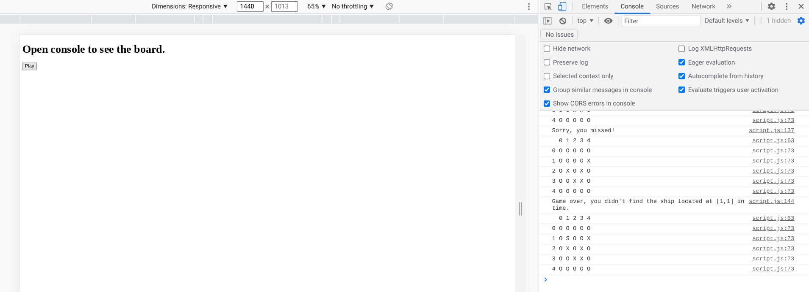

# JS Battleship

## Table of contents

- [Overview](#overview)
  - [Screenshots](#screenshots)
  - [Link](#link)
- [Continued development](#continued-development)
- [Useful resources](#useful-resources)
  
## Overview

Simplified battleship game with 1 ship and limited turns.  Played with window prompt and displays board in browser console.  Derivative of [Simple JS Battleship Tutorial](https://www.youtube.com/watch?v=QLLfgYpbAbM) and [Battleship Python Code Roast](https://www.youtube.com/watch?v=u3yo-TjeIDg).

### Screenshots

## Link

- [Github Pages](https://jdegand.github.io/js-battleship)

## Continued Development

- Row and column input order - originally set it where row is chosen before column - have to change the order of prompts and order of some function parameters to reverse order
- Problem - script file executes before html is loaded. Prompt in browser and elements tab is empty. Have to play one whole game before the html will finally be loaded in.  This prevents the console.logs from displaying.  
- Changed code to have game start on the click of a button vs just calling the  main() function at the end of the script file. 
- Could still have issues.
- Changing to button - allows you to play another game after previous game is over vs having to reload the browser to get the script to run again
- Could try to add the board to the html with js
- Replacing while loops in the script could require a significant rework of the game's logic 

## Useful Resources

- [YouTube](https://www.youtube.com/watch?v=QLLfgYpbAbM) - Simple JS Battleship Tutorial
- [Github](https://github.com/promineotech/js-simple-battleship/blob/master/index.js) - js simple battleship
- [YouTube](https://www.youtube.com/watch?v=7Ki_2gr0rsE) - Battleship Python
- [YouTube](https://www.youtube.com/watch?v=u3yo-TjeIDg) - Battleship Python Code Roast Part 1
- [YouTube](https://www.youtube.com/watch?v=n0ngeLBJBNU) - Battleship Python Code Roast Part 2
- [Github](https://github.com/ArjanCodes/2022-coderoast-battleship/blob/main/after.py) - Code Roast after code
- [Stack Overflow](https://stackoverflow.com/questions/40980475/using-node-jss-prompt-for-user-input) - node js user prompt
- [Stack Overflow](https://stackoverflow.com/questions/65682207/create-2d-array-without-looping-javascript) - create 2d array without looping
- [Stack Overflow](https://stackoverflow.com/questions/7884081/what-is-the-use-of-the-init-usage-in-javascript) - init in js
- [Stack Overflow](https://stackoverflow.com/questions/32647215/declaring-static-constants-in-es6-classes) - static constants in classes
- [MDN Docs](https://developer.mozilla.org/en-US/docs/Web/JavaScript/Reference/Classes) - Classes
- [Stack Overflow](https://stackoverflow.com/questions/50633214/script-defer-doesnt-seem-to-work-as-expected) - defer & local scripts
- [Sitepoint](https://www.sitepoint.com/community/t/alert-is-loading-before-the-html-despite-js-script-at-end-of-body/279774/5) - alert is loading before html
- [Stack Overflow](https://stackoverflow.com/questions/53111553/for-some-reason-the-javascript-loads-even-before-my-html-css-page-is-loaded) - js loading before html
